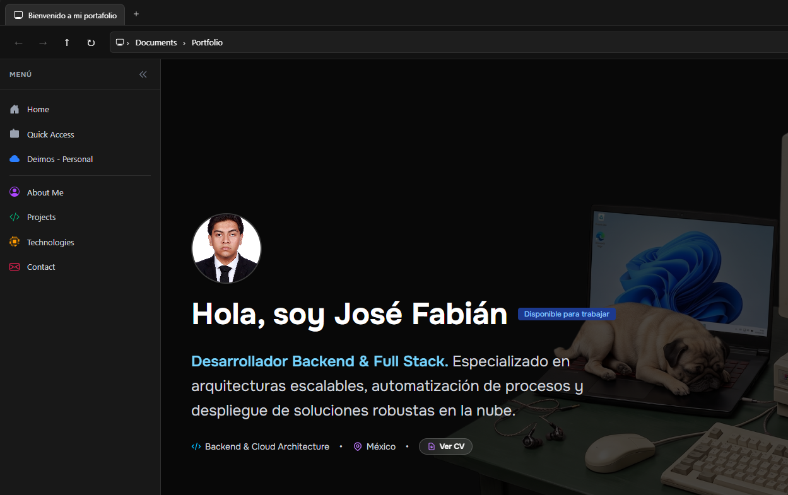

# Personal Portfolio - Windows UI Experience

[](https://astro.build/)
[](https://tailwindcss.com/)
[](https://github.com/)

Hi! This repository contains the source code for my personal web portfolio, developed by José Fabián.

This is a practice project created specifically to learn, master the basics, and explore the advantages of the Astro framework—going from a beginner level to building a fully functional and optimized product.

---

## Key Features

- **OS-Style Interface:** Custom layout mimicking a desktop taskbar, window controls, and modals.
- **Interactive CV Viewer:** Integrated custom PDF modal viewer with dynamic zoom controls (`+` / `-`).
- **Dynamic Theming:** Seamless light and dark mode support with synchronized system preferences.
- **High Performance:** Built with **Astro** for zero client-side JavaScript by default and lightning-fast static delivery.
- **Fully Responsive:** Optimized for both desktop displays and mobile devices.

---

## Tech Stack

- **Framework:** [Astro](https://astro.build/)
- **Styling:** [Tailwind CSS](https://tailwindcss.com/)
- **Typography:** [Fontsource Onest Variable](https://fontsource.org/)
- **Deployment:** GitHub Actions & GitHub Pages

---

## Screenshots



---

## Project Structure

Inside this Astro project, the directory structure is organized into modular components:

```text
portfolioinfo/
├── public/
│   ├── cv.pdf                 # Professional Resume
│   └── favicon.svg            # Custom Site Favicon
├── src/
│   ├── assets/                # Static assets & images
│   ├── components/
│   │   ├── icons/             # Modular SVG icon components (Java, Docker, Windows, etc.)
│   │   ├── photos/            # Profile and project photographs
│   │   ├── About.astro        # About section component
│   │   ├── ContactMe.astro    # Contact form & info component
│   │   ├── CvModal.astro      # Interactive PDF modal viewer
│   │   ├── Experience.astro   # Work history & timeline
│   │   ├── Footer.astro       # Bottom layout footer
│   │   ├── Header.astro       # Top navigation header
│   │   ├── Projects.astro     # Showcase of developed projects
│   │   ├── Technologies.astro # Tech stack display
│   │   ├── WSidebar.astro     # Windows-style sidebar
│   │   └── WTaskbar.astro     # Windows-style interactive taskbar
│   ├── layouts/
│   │   └── Layout.astro       # Main application layout wrapper & HTML head
│   ├── pages/
│   │   └── index.astro        # Main portfolio landing page
│   └── styles/
│       └── global.css         # Global Tailwind configurations & scrollbars
├── astro.config.mjs           # Astro configuration file
├── package.json               # Dependencies and project metadata
└── tsconfig.json              # TypeScript configuration
```
